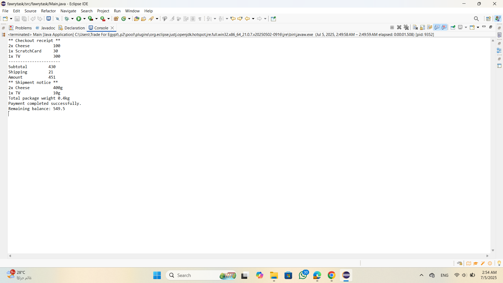

  # E-Commerce Checkout System (Java)

This Java-based project simulates a simple e-commerce checkout process with various product types, cart management, and customer balance validation.

---

## Overview

The system supports the following features:

### Product Types
- **RegularProduct**: Standard item with price and quantity
- **PerishableProduct**: Includes an expiry date and must be checked before purchase
- **ShippableProduct**: Has weight and includes a shipping cost in total price

### Shopping Cart
- Holds multiple products with specified quantities

### Customer
- Has a balance used to pay for items in the cart

### Checkout Process
- Validates:
  - Product availability
  - Expiry for perishable products
  - Sufficient stock
  - Customer's balance
- Calculates subtotal and shipping cost
- Deducts the total from customer balance
- Updates product quantities
- Prints formatted checkout summary and shipping notice

---

## Edge Cases Handled
- Empty cart
- Expired perishable products
- Insufficient stock
- Insufficient customer balance

---

## How It Works

1. Products (regular, perishable, or shippable) are added to the cart with specific quantities.
2. On checkout:
   - System checks for expired items and stock availability.
   - Calculates total price, including shipping for shippable products.
   - Verifies if the customer can afford the total.
3. If all checks pass:
   - Customer’s balance is reduced.
   - Product stock is updated.
   - Receipt and shipping summary are printed.
4. If any issue occurs:
   - A message is printed explaining the issue (e.g. expired product, insufficient balance, etc.)

---

## Project Structure

- `Product` – base class
- `PerishableProduct` – extends `Product`, adds `expiryDate`
- `ShippableProduct` – extends `Product`, adds `weight`
- `Cart` – holds products and quantities
- `Customer` – represents user with a balance
- `Checkout` – handles validation, payment, and receipt printing
- `Test` – main class to demonstrate the complete flow

---

## How to Run

1. Compile all `.java` files
2. Run the `Test` class
3. Follow the console output to view:
   - Cart processing
   - Checkout results
   - Receipt and shipping notices

---

## Requirements

- Java SE Development Kit (JDK) 8 or higher
- Any IDE such as Eclipse or IntelliJ (optional)

## Screenshots

# 1. Application Running in Eclipse

.png)

# 2. Console Output After Purchase

